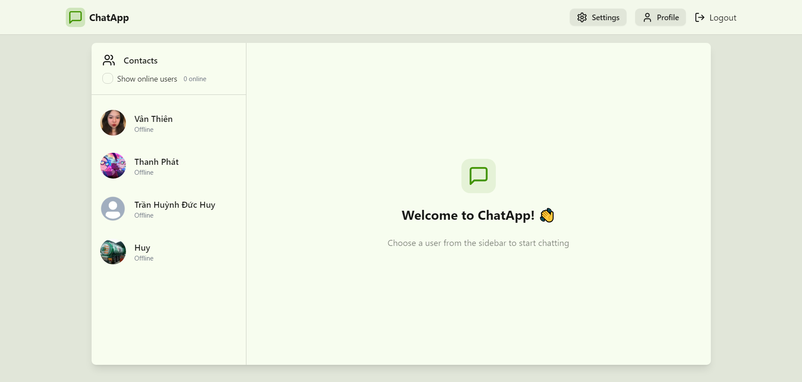
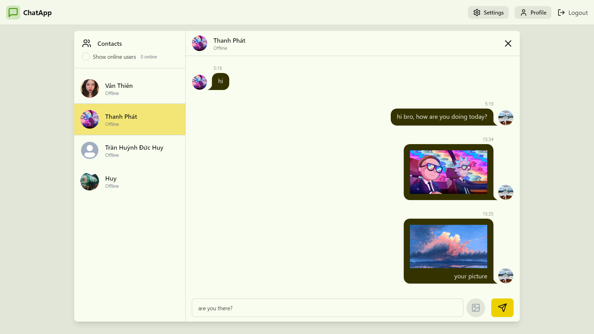
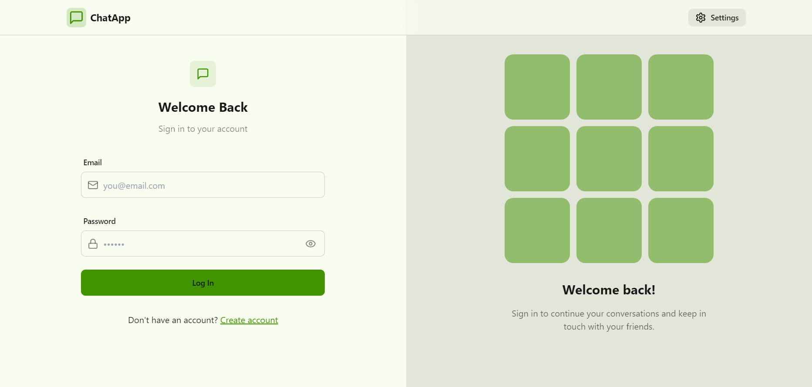
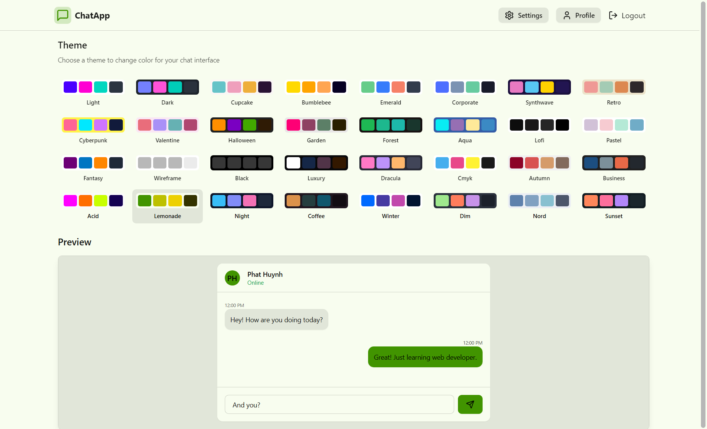
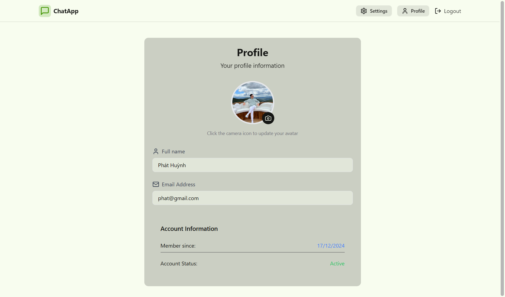

<h1 align="center">Chat App Realtime 💬</h1>

# [Live Demo](https://chat-app-6tdw.onrender.com/)

## Features

- User Authentication: Sign up, login with email (Authorization with JWT).
- Theme setting: Switch between 32 themes from daisyUI.
- User Management: Update user information.
- One-on-One Chat: Private messaging between two users.
- Online: Showing online user status.
- Real-time Messaging: Send and receive messages (text & image) instantly with Socket.io.
- Responsive Design: Optimized for both desktop and mobile devices.

- [React](https://reactjs.org/): Used to build user interfaces for websites.
- [Vite](https://vite.dev/guide/): A fast build tool that optimizes performance for React applications.
- [Zustand](https://zustand-demo.pmnd.rs/): A simple, lightweight, and easy-to-use state management alternative to Redux.
- [Axios](https://axios-http.com/docs/intro): Used to make API requests between the frontend and backend, helping to retrieve and send data.
- [TailwindCSS](https://tailwindcss.com): Build the interface just by declaring the class in the HTML file, create skeleton very quickly.
- [daisy UI](https://daisyui.com/): A Tailwind CSS component library that simplifies UI design with pre-built themes and components.
- [Cloudinary](https://cloudinary.com/): A cloud-based media management service for optimizing, storing, and delivering images and videos.
- [Socket.io](https://socket.io/): A real-time communication library enabling WebSocket-based interactions for live updates and messaging.
- [Node.js](https://nodejs.org/docs/latest/api/): Process requests from users and manage data efficiently.
- [Express.js](https://expressjs.com/): Builds a backend API to handle functions such as user authentication, product management, cart and orders.
- [MongoDB](https://www.mongodb.com/): Stores website data.
- [JSON Web Token](https://www.npmjs.com/package/jsonwebtoken): Authenticate and manage user access rights, ensuring security when logging in and using the system.

### Preview

